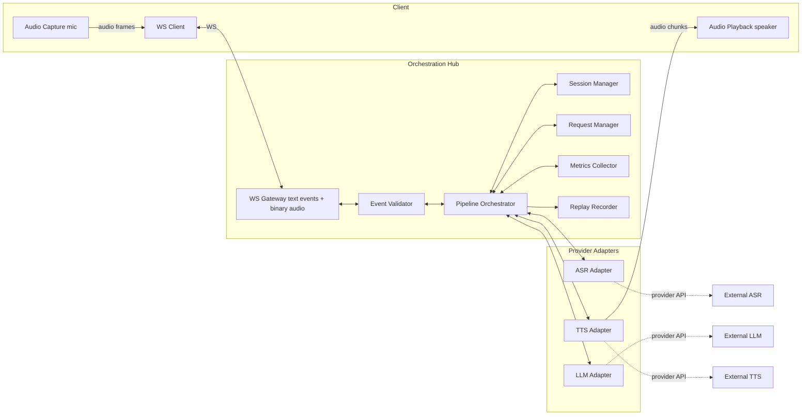

# Milestone M0 — Project Specification and Architecture

**Real-Time Multimodal Voice AI Assistant**

| | |
|---|---|
| **Milestone** | M0 — Specification & Architecture (documentation only) |
| **Status** | Proposed spec — pending technology decisions (see §22) |
| **Scope** | Architecture/specification documentation. No application logic. |
| **Owner role** | Implementation engineer (spec authored for architecture-owner approval) |

---

## 1. Project Overview

This project is a **real-time, multimodal voice AI assistant**. A user speaks into a
microphone, and their voice is streamed through a live pipeline:

```
Audio Input → Streaming ASR → LLM Reasoning → Streaming TTS → Audio Output
```

The system is orchestrated over a **WebSocket-based transport** that carries
structured events, streaming audio, transcripts, model output, synthesized audio,
and operational telemetry. It is designed for **low latency, live interruption,
and production-grade observability** rather than simple turn-atomic request/response.

The assistant is deliberately built as a **modular pipeline** in which every
external AI capability (speech-to-text, language model, text-to-speech) is
**abstracted behind an interface** so that any provider can be swapped and every
provider can be **mocked deterministically in tests**.

---

## 2. Problem Statement

Delivering a natural, conversational voice assistant that feels "real-time" is
fundamentally different from building a chat-reply service. The core challenges are:

1. **Latency**: Users perceive delay. Waiting for a full turn to complete before
   speaking forces every stage (ASR → LLM → TTS) to finish before any audio returns.
   Real-time systems must **stream** at every stage: partial transcripts, streaming
   LLM tokens, and synthesized audio chunks played as they arrive.
2. **Interruption**: A user must be able to **cut the assistant off mid-utterance**
   and be heard immediately. This requires a **cancellation model** that propagates
   through the whole pipeline without leaving dangling work.
3. **Observability**: "It sounds slow / it cut me off badly" is not diagnosable.
   We need **structured events** and **latency measurements** (ASR, LLM TTFT,
   TTS TTFB, end-to-end) tied to session and request IDs.
4. **Reproducibility**: Intermittent problems with live audio/model providers are
   hard to debug. We need a **replay strategy** so failures can be re-run
   deterministically.
5. **Isolation of external providers**: Directly coupling code to a vendor's SDK
   makes testing slow, flaky, and network-dependent, and locks the architecture to
   one vendor. Providers must sit behind interfaces.

---
## 3. Goals

The system must:

- Stream microphone audio to ASR and emit **partial and final transcripts** in
  real time.
- Feed recognized speech into an **LLM whose output streams** token by token.
- Convert streamed text to **synthesized audio delivered in chunks** as they are
  produced.
- Orchestrate all stages over a **WebSocket transport** with **session IDs** and
  **request IDs**.
- Exchange **structured, validated events** (a single event schema, validated at
  the boundary).
- Support **cancellation/interruption** at any point in the pipeline.
- Measure and emit **latency metrics**: ASR latency, LLM time-to-first-token (TTFT),
  TTS time-to-first-byte (TTFB), and **end-to-end latency**.
- Provide **resilience/failure handling** with a typed error model and explicit
  retry semantics.
- Provide a **replay/debugging** capability for deterministic reproduction.
- Be covered by **automated tests** (with deterministic mocks for all external
  providers) and documented **manual verification** procedures.
- Be **runnable and verified at the end of every milestone**.
- Keep configuration and **secrets out of source code** (environment-driven).

---

## 4. Non-goals

The following are **out of scope** for this project and must not be implemented
unless explicitly approved:

- On-device / fully-local embedded inference by default (runtime/storage provider
  choice is `DECISION REQUIRED`).
- Video or image understanding. The input is **audio**; "multimodal" here refers to
  the **voice dialogue pipeline** (audio in, text + audio out), not general
  vision input.
- Model training, fine-tuning, or prompt-engineering R&D.
- Building our own speech recognition / LLM / TTS models. We use/interact with
  providers behind interfaces.
- Multi-tenant SaaS productization: billing, user accounts, teams, admin dashboards,
  multi-region failover.
- Hard real-time guarantees (this is a soft-latency-optimized system, not a
  deterministic control system).
- Mobile/desktop native application packaging and stores.
- Plugin/third-party extension ecosystem.
- Long-term conversation memory / vector-store persistence of user history.

---
## 5. System Architecture

The assistant is a **client ↔ orchestration-hub** architecture over WebSocket.
All external AI capabilities are reached through **provider adapters** behind
interfaces, so the orchestration layer has no direct dependency on any vendor.



**Layering principle:** the orchestration hub knows only about **interfaces**
(`ASRProvider`, `LLMProvider`, `TTSPProvider`), never concrete SDKs. This enforces
§2/§4 of `.clinerules` (provider abstraction) and §3 (deterministic mocking).

---

## 6. Component Responsibilities

| Component | Responsibility | Key interface / concern |
|---|---|---|
| **WS Gateway** | Terminates the WebSocket; correlates text event envelopes and binary audio frames; applies framing, ordering, backpressure. | Transport framing |
| **Event Validator** | Validates every inbound/outbound event against the event schema; rejects malformed events with a typed validation error. | Event schema (§8) |
| **Pipeline Orchestrator** | Drives ASR → LLM → TTS for a request; handles streaming, cancellation propagation, and event routing. | Orchestration; cancellation (§12) |
| **Session Manager** | Owns session lifecycle, inactivity/expiry, and resource cleanup tied to a `session_id`. | Session model (§10) |
| **Request Manager** | Owns `request_id` lifecycle, cancellation scope, and per-request state. | Request model (§10) |
| **ASR Adapter** | Streaming speech-to-text behind `ASRProvider`; emits partial/final transcripts. | `DECISION REQUIRED` (D3) |
| **LLM Adapter** | Streaming language-model generation behind `LLMProvider`; emits token stream. | `DECISION REQUIRED` (D4) |
| **TTS Adapter** | Streaming synthesis behind `TTSPProvider`; returns audio chunks + TTFB. | `DECISION REQUIRED` (D5) |
| **Audio Codec** | Transcodes PCM ↔ wire audio format (Opus/WebM/etc.). | `DECISION REQUIRED` (D9) |
| **Metrics Collector** | Records monotonic timestamps at measurement points and emits latency events (§13). | ASR latency, LLM TTFT, TTS TTFB, E2E |
| **Replay Recorder** | Persists ordered events per `request_id` for deterministic replay (§14). | `DECISION REQUIRED` (D10) |

---

## 7. Data Flow

A complete request flows as follows (all times use **monotonic clock**, §13):

1. **Session open**: Client connects; server creates `session_id`, emits
   `session.started`.
2. **Audio in**: Client captures microphone audio, encodes (`DECISION REQUIRED`
   D9), and streams `audio.frame` binary payloads over WS.
3. **ASR**: Orchestrator forwards frames to the ASR adapter, which returns
   **partial transcripts** (`transcript.partial`) and finally a **final transcript**
   (`transcript.final`).
4. **LLM**: Orchestrator submits the final transcript to the LLM adapter and streams
   output tokens (`llm.token`); TTFT is measured at the first token.
5. **TTS**: Orchestrator feeds the streamed text to the TTS adapter, which returns
   synthesized audio chunks (`tts.audio`); TTFB is measured at the first byte.
6. **Audio out**: Orchestrator forwards `tts.audio` chunks to the client for playback.
7. **Completion / interruption**: On natural end, `request.completed` (+ `metrics`).
   On user barge-in, `request.canceled` propagates upstream (§12).
8. **Replay/telemetry**: All structured events are recorded per `request_id`
   (`metrics.events`) and optionally persisted for replay (§14).

Data is always tagged with `session_id` and `request_id` so the orchestration,
metrics, and replay layers can correlate everything.

---
## 8. WebSocket / Event Architecture

### 8.1 Transport framing
- **Text messages** carry **structured event envelopes** (JSON).
- **Binary messages** carry **audio frames** (encoded per D9).
- Message type is distinguished at the frame level (Opcode/Type byte), so the
  gateway can route reliably without parsing binary content.

### 8.2 Event envelope
Every structured event uses one common envelope:

```jsonc
{
  "type": "<event-type>",          // from the event catalog (§9)
  "version": "1.0",                // schema version
  "session_id": "ses_...",         // immutable (§10)
  "request_id": "req_...",         // immutable (§10)
  "seq": 42,                       // strictly increasing per connection/request
  "timestamp": 1720000000.123,     // monotonic ms (see §13)
  "payload": { }
}
```

### 8.3 Ordering & backpressure
- Events and audio within one request are **sequenced** (`seq`) and **ordered** by
  the orchestrator before forwarding.
- The WS gateway applies **backpressure** when the client is slower than the
  pipeline; TTS audio buffering policy is defined at implementation time.

### 8.4 Validation
- Every event is validated at the **boundary** (inbound and outbound) by the Event
  Validator (§6) against the catalog. Unknown types, wrong version, or missing IDs
  are rejected with `error.kind = validation`.

---

## 9. Event Lifecycle

The catalog below is the **agreed event vocabulary** (subject to refinement during
implementation milestones). Each event has an **origin** (client / server / provider)
and the server enforces a **state machine** so illegal transitions are rejected.

### 9.1 Event catalog

| Event | Origin | Meaning |
|---|---|---|
| `session.started` | server | WS accepted; `session_id` issued |
| `session.ended` | server | Session closed/expired; resources released |
| `audio.frame` | client | Binary audio chunk (see §8.1) |
| `audio.eos` | client | Client signals end-of-stream for current utterance |
| `transcript.partial` | server | Interim ASR hypothesis |
| `transcript.final` | server | Finalized ASR result for the request |
| `llm.token` | server | A streamed text token (delta) |
| `llm.error` | server | Provider/stream failure in generation |
| `tts.audio` | server | Synthesized audio chunk (binary) |
| `tts.done` | server | TTS finished for the request |
| `request.started` | server | New `request_id` opened |
| `request.completed` | server | Request finished normally |
| `request.canceled` | server/client | Request interrupted (§12) |
| `request.error` | server | Terminal error for the request (§11) |
| `error` | server/client | Non-request-scoped error (transport/validation) |
| `metrics` | server | Latency/telemetry snapshot for a request (§13) |
| `replay` | server | Replay control event (§14) |

### 9.2 Request state machine (server-enforced)

```
                  ┌──────────────┐
  audio.frame     │              │
in────────────────┼► ASR stream  │
                  └──────┬───────┘
                         │ transcript.final
                         ▼
                  ┌──────────────┐
                  │  LLM stream  │──► llm.token (TTFT at first token)
                  └──────┬───────┘
                         │ completion
                         ▼
                  ┌──────────────┐
                  │  TTS stream  │──► tts.audio (TTFB at first byte)
                  └──────┬───────┘
                         ▼
                  ┌──────────────┐
                  │ request.done │──► request.completed | request.canceled | request.error
                  └──────────────┘
```

Any event can transition into an **interrupted/error path** via cancellation (§12)
or an error (§11). Once a request reaches `completed`, `canceled`, or `error`, it is
**terminal** — no further events for that `request_id` are accepted.

---
## 10. Session / Request Model

- **IDs are immutable, opaque, and unique.** Pattern `ses_<k>` / `req_<k>` (exact
  scheme finalized at implementation). Both are generated by the **server** (never
  accepted verbatim from clients beyond creation).
- **Session** owns client connectivity and resource lifetimes:
  - Created at WS upgrade; `session.started`.
  - Has an **inactivity/expiry policy** (`DECISION REQUIRED` value).
  - On expiry/close: `session.ended` and cleanup of all in-flight requests.
- **Request** is the unit of a single user utterance → response cycle:
  - Created via `request.started`; the **cancellation scope** is per-request (§12).
  - Contains ASR result, LLM stream, TTS stream, and its own latency snapshot.
  - Terminates in exactly one of: `completed`, `canceled`, `error`.
- A **session may own many sequential (and, if approved, concurrent) requests**;
  each request holds a stable `request_id` for correlation via §§13–14.

---

## 11. Error Model

Errors are **typed** and carry a stable machine-readable kind + human message. They
are never exposed as raw provider exceptions to the client.

| `kind` | Origin | Retryable | Example |
|---|---|---|---|
| `transport` | connection | no | frame parse failure, timeout |
| `validation` | boundary | no | malformed/missing envelope fields (§8.4) |
| `asr` / `llm` / `tts` | provider | policy | rate limit, unavailable |
| `timeout` | orchestration | no | provider exceeded budget |
| `canceled` | orchestration | no | user interruption (§12) |
| `internal` | server | no | unexpected bug |

- **Retry policy**: only `asr`/`llm`/`tts` provider transient failures are
  retryable, with a **bounded, configured retry count + backoff** (values finalized
  at implementation). `transport`/`validation`/`timeout`/`canceled`/`internal` are
  **not** retried.
- Every terminal error is delivered as `request.error` (scoped) or `error`
  (non-scoped) with the `kind`.

---

## 12. Cancellation Model

- **Scope**: cancellation is **per-request**. Canceling a request does not destroy
  the session.
- **Trigger**: client sends `request.cancel` (barge-in) or the session ends/errors.
- **Propagation**: the orchestrator instructs the **ASR, LLM, and TTS adapters to
  stop** their upstream streams. Adapters must cancel both their underlying provider
  call and local buffering.
- **Semantics**:
  - Any already-produced `tts.audio` chunks are discarded unless already flushed.
  - The request transitions to `request.canceled` (terminal).
  - In-flight provider calls are freed; no orphaned work.
- **Idempotency**: cancel is idempotent — repeated cancels for an already-done
  request are treated as no-ops acknowledged by state, not errors.
- **Race handling**: if the pipeline completes concurrently with a cancel, the
  terminal state is decided exactly once by the request state machine (§9.2).

---

## 13. Latency Measurement Plan

- **Clock discipline**: all timestamps are **monotonic** (never wall-clock for
  math); wall clock used only for log/display. Monotonic source from the runtime
  platform.
- The `metrics` event carries a per-request snapshot:

| Metric | Symbol | Measured from → to | Bound to event |
|---|---|---|---|
| **ASR latency** | `asr_latency_ms` | `audio.frame` (EOS) → `transcript.final` | `transcript.final`/`metrics` |
| **LLM TTFT** | `llm_ttft_ms` | LLM request start → first `llm.token` | `llm.token` first |
| **TTS TTFB** | `tts_ttfb_ms` | first TTS text → first `tts.audio` byte | `tts.audio` first |
| **End-to-end** | `e2e_latency_ms` | user speech onset (EOS) → first response audio byte | `metrics` |

- **Points of instrumentation are fixed** at the adapter/orchestrator boundaries so
  measurements are comparable across providers and runs.
- Aggregation (min/p50/p90/max) is a reporting concern, performed on the emitted
  `metrics` events; the pipeline itself emits raw per-request measurements.

---
## 14. Replay Strategy

- **Record**: The Replay Recorder persists, in order, every structured event +
  binary audio chunk for a `request_id` (correlation via §10). Storage choice:
  `DECISION REQUIRED` (D10).
- **Replay**: a recorded request can be re-fed into the orchestrator using the
  **recorded events with the chosen provider mocked** to its recorded outputs,
  producing a **deterministic, offline reproduction** of the original behavior —
  including latency snapshots (§13) and cancel/error paths.
- **Use cases**: debugging intermittent provider behavior, validating new code
  against a known-good run, and generating regression fixtures for automated tests
  (§15).
- **Correlation**: replay is keyed by `request_id`; timestamps are re-based on replay
  so latency math is recomputed identically.

---

## 15. Testing Strategy

Per `.clinerules` §3, every implementation milestone includes **automated tests**
with a **deterministic mocked path** for all external services — no live network
dependency.

- **Unit tests**: adapter interfaces, event schema/validators, state machine
  transitions (incl. cancellation and terminal states), latency math.
- **Integration tests**: orchestrator + mocked ASR/LLM/TTS adapters driving the full
  pipeline in-process; assert event ordering, validation, metrics, cancel
  propagation.
- **End-to-end tests**: WS transport + in-process orchestration + **mock
  providers**; assert event envelopes end-to-end without external calls.
- **Replay tests**: recorded fixtures replayed deterministically (§14) to assert
  identical behavior.
- **Sources of truth**: event catalog (§9) and latency math (§13) are asserted in
  tests. Never delete/weaken existing tests to pass (§3).
- **Lint/static checks**: run per milestone (`DECISION REQUIRED` D8).
- **Test framework**: `DECISION REQUIRED` (D7).

---

## 16. Manual Testing Strategy

Per `.clinerules` §5, each milestone ships a **`MANUAL VERIFICATION`** section with
**exact commands/actions and expected results**. For M0 (documentation only), manual
verification is document inspection (see the `MANUAL VERIFICATION` section at the end
of this file).

For **implementation milestones**, the manual strategy is a live, real-audio
end-to-end script covering:
1. Speak a fixed phrase into the mic; verify echoed synthesized audio.
2. Read the printed `metrics` (ASR latency, LLM TTFT, TTS TTFB, e2e) and check they
   fall within the agreed budget.
3. Interrupt (barge-in) mid-TTS; verify the assistant stops and immediately picks up
   a new utterance (`request.canceled`).
4. Kill the provider-key env var / point at a bad endpoint; verify a typed
   `error` is surfaced, not a crash.
5. Re-run a recorded request via replay and compare output/metrics deterministically.

Each milestone lists its specific commands + expected results; this section defines
the shared methodology.

---

## 17. Security Considerations

- **Transport**: WebSocket over **TLS** (wss) in any production-facing deployment.
- **Auth**: session/connection authentication via issued token / cookie (design
  finalized at implementation); never accept unauthenticated upgrades in prod.
- **Secrets**: API keys for ASR/LLM/TTS come from **environment/configuration** and
  are **never** written to code, logs, tests, or docs (§4 of `.clinerules`).
- **Provider invocation**: server-side only; keys never sent to the client.
- **Input/output sanity**: validate event size/shape (§8.4) and impose rate limits
  on audio/request volume to prevent abuse (values at implementation).
- **Log hygiene**: sanitize logs — no keys, no full raw transcripts unless explicitly
  configured, no PII beyond the immediate session necessity.
- All security-critical constants default to **deny** unless explicitly enabled.

---

## 18. Configuration / Secrets Strategy

- **Source**: all configuration (endpoints, model params, timeouts, budgets, retry
  counts, formats) is read from **environment/configuration** at startup — never
  hardcoded (`.clinerules` §4).
- **Secret handshake**: required keys are gated by a startup check that fails fast
  if the environment variable is absent. Documented variable **names** (never
  values) per provider, finalized with each provider decision (D3/D4/D5).
- **Provider selection**: the active ASR/LLM/TTS implementation is chosen by
  configuration through the interface layer, enabling mock-vs-real switching without
  code changes (supports §3/§15).
- **Per-environment**: dev/test/prod config separation using standard
  config-loader for the chosen runtime (D2), keeping secrets in environment secrets
  store.
- **No secrets in repo**: `.env`-style files, if used, are git-ignored and never
  committed. Any example config ships with placeholder names only.

---
## 19. Project Directory Structure

Target layout (finalized once the runtime/stack is decided, D1/D2). Documentation
only — nothing is created in M0 except this file.

```
Voice Assisstant/
├─ .clinerules                      # project rules (exists)
├─ docs/
│  └─ architecture.md               # this specification (Milestone M0)
├─ src/assistant/
│  ├─ transport/                    # WS gateway, framing, backpressure
│  ├─ events/                       # event schema catalog, validator, state machine
│  ├─ core/                         # orchestrator, session/request managers
│  ├─ providers/                    # ASR/LLM/TTS interfaces + adapters
│  │  ├─ asr/  llm/  tts/
│  ├─ audio/                        # codec/transcoding (D9)
│  ├─ metrics/                      # latency instrumentation, metrics events
│  └─ replay/                       # recorder + replay runner (D10)
├─ tests/                           # unit/integration/e2e + fixtures
├─ scripts/                         # manual verify scripts, dev tools
└─ pyproject.toml (or stack equivalents, D1/D2)   # deps, lint, test config
```

---

## 20. Milestone Roadmap

Roadmap is written as **runnable, tested increments** (`.clinerules` §1/§6/§20).
M0 is complete once this spec is approved; subsequent milestones implement the spec
one concern at a time.

| Milestone | Focus (scope) | Primary § references |
|---|---|---|
| **M0** | Specification & architecture (this doc) | all |
| **M1** | Skeleton: stack, WS transport, event envelope + validator, session/request model | §6, §8, §9, §10 |
| **M2** | Streaming ASR via adapter interface + mocked provider + `transcript.*` events | §6, §7, §15 |
| **M3** | Streaming LLM via adapter + token stream + TTFT | §6, §13 |
| **M4** | Streaming TTS via adapter + audio chunks + TTFB, audio output | §6, §13 |
| **M5** | Latency pipeline: ASR/TTFT/TTFB/e2e `metrics` events wired end-to-end | §13 |
| **M6** | Cancellation/interruption: per-request cancel, propagation, idempotency | §12 |
| **M7** | Error model & resilience: typed errors, retry policy, timeouts, failure injection | §11 |
| **M8** | Replay/debugging: recording + deterministic replay | §14 |
| **M9** | Observability: structured logging, metrics aggregation, dashboards | §13/§18 |
| **M10** | Hardening & full manual verification pass, security review | §16/§17 |

> Ordering may shift by mutual agreement; each milestone stays independently
> runnable + tested.

---

## 21. Acceptance Criteria for Every Milestone

Reused from `.clinerules` §6 — every milestone (starting after M0) **must** yield all
of the following, or it is **not complete**:

1. **Implementation** — working, small, well-typed modules within agreed scope.
2. **Automated tests** — covering the new code; deterministic mocks for all external
   providers; no weakening/deleting existing tests to pass.
3. **Test execution** — relevant suite + lint/static checks run; exact commands and
   exact results reported.
4. **Manual verification instructions** — a `MANUAL VERIFICATION` section with exact
   commands/actions and expected results (`.clinerules` §5).
5. **Documentation** of what was completed and how it maps to this spec.
6. **Known limitations** — explicitly listed.
7. **Runnable** — project still runs and passes its tests after the milestone.

---
## 22. Technology Decisions and Justification

The choices below are **`DECISION REQUIRED`** — they were **not specified** in the
approved brief, so per your instruction I am **not inventing** them. Each is listed
with options and trade-offs. **The pipeline/core events, interfaces, metrics,
cancellation, and replay designs in this spec (§§5–14) are provider-agnostic by
design** so these choices can be made without changing the architecture.

### D1 — Backend runtime/language
| Option | Strengths | Trade-offs |
|---|---|---|
| Python + asyncio | Rich AI/audio ecosystem; rapid iteration | GIL; perf tuning harder |
| Node.js | Strong WS/concurrency, JS ecosystem | Weaker native ASR/TTS bindings |
| Go | High perf, low latency, strong typing | Slower AI-provider ecosystem |

### D2 — WebSocket / HTTP stack
- `websockets` (Python, minimal) / FastAPI + WebSocket (batteries-included) / raw
  asyncio / framework-native (per D1). Trade-off: dependency surface + request
  lifecycle tooling vs. control.

### D3 — Streaming ASR provider
- Deepgram / AssemblyAI / OpenAI Realtime / Azure Speech / local Whisper. Trade-offs:
  streaming-partial support, latency, cost, data-residency, offline ability.

### D4 — LLM provider
- OpenAI / Anthropic / Azure / local model. Trade-offs: streaming token support,
  quota/cost, latency, policy/compliance.

### D5 — Streaming TTS provider
- ElevenLabs / Azure TTS / OpenAI TTS / local Kokoro-type. Trade-offs: chunked
  synthesis latency (TTFB), voice quality, cost, offline.

### D6 — Event schema + validation library
- Pydantic / JSON Schema / msgspec. Trade-off: speed vs. DX vs. schema-as-contract.

### D7 — Test framework
- pytest / jest / Go native. Depends on D1. Requirement: fixtures for deterministic
  mocks + param-friendly.

### D8 — Lint + static checks
- Python: ruff + mypy / Node: ESLint + TypeScript / Go: golangci + go vet. Aligns
  with D1.

### D9 — Audio format/transcoding
- Raw PCM / Opus / WebM. Trade-offs: bandwidth, CPU, real-time decode latency,
  browser/client support.

### D10 — Replay/persistence store
- Local file store / SQLite / object storage. Trade-off: simplicity vs. scale vs.
  tooling.

### D11 — Observability
- stdlib JSON logs / structlog / OpenTelemetry tracing. Trade-off: dependency
  weight vs. tracing/aggregation power.

**Non-negotiable (from `.clinerules`, not decisions):** provider abstraction behind
interfaces (§2/§4), env-driven secrets (§4), deterministic mocked tests (§3), no
unnecessary dependencies (§7).
---

## Known Limitations (M0)

- M0 is documentation only; nothing is runnable yet.
- Provider-specific latencies, formats, and retry numbers are placeholders pending
  D1–D11.
- Default audio format, inactivity timeout, backpressure policy, and rate limits are
  **TBD** and must be set at the corresponding implementation milestone.
- The deployment/ops topology (single process vs. gateway+workers) is TBD pending D1/D2.
- Event catalog (§9) may gain provider-specific event types during implementation.

---

## MANUAL VERIFICATION

Action: inspect the file `docs/architecture.md` at the repository root:
`C:\Users\hp\Documents\projects\AIML\Voice Assisstant\docs\architecture.md`.

Expected results:
1. **All 22 sections present** in order: §1 Project overview … §22 Technology
   decisions and justification — a section heading exists for each requested number.
2. **No provider imputed**: §3 (Goals), §5 (Architecture), and §22 contain no
   concrete ASR/LLM/TTS vendor names as *decided* choices; any that appear are inside
   the §22 `DECISION REQUIRED` options list.
3. **`DECISION REQUIRED` markers** appear for D1–D11 in §22 (runtime, WS stack, ASR,
   LLM, TTS, validation lib, test framework, lint, audio format, replay store,
   observability).
4. **Required enforcements present**: §15 mentions deterministic mocks for external
   providers; §18 says secrets come from environment and are never hardcoded; §21
   lists the acceptance criteria; the closing sections `Known Limitations` and
   `MANUAL VERIFICATION` exist.
5. **No application code introduced**: the workspace contains only `.clinerules`
   and `docs/architecture.md` (plus the `docs/` directory) — no `src/`, no
   `pyproject.toml`, no packages installed.
6. The prose at §1 matches the goal statement: WebSocket orchestration and
   `Audio Input → Streaming ASR → LLM Reasoning → Streaming TTS → Audio Output`.

## MILESTONE STATUS — PASS

**Reason:** The M0 deliverable (architecture & specification documentation) was
created at `docs/architecture.md` with all 22 requested sections, a `DECISION
REQUIRED` register (D1–D11) for unapproved technology choices, the mandated
provider-abstraction / deterministic-mock / secrets / acceptance-criteria
enforcements, an explicit non-goals scope, and a milestone roadmap with per-milestone
acceptance criteria. No application code, packages, or application logic were
introduced, per milestone scope. Pending only your approval of the `DECISION
REQUIRED` register to proceed to implementation milestones.